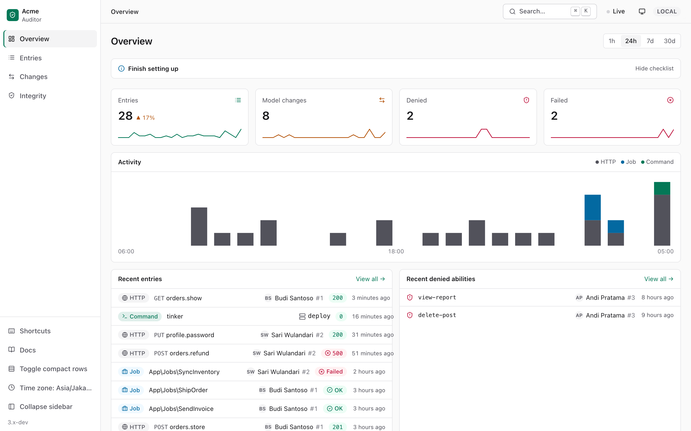
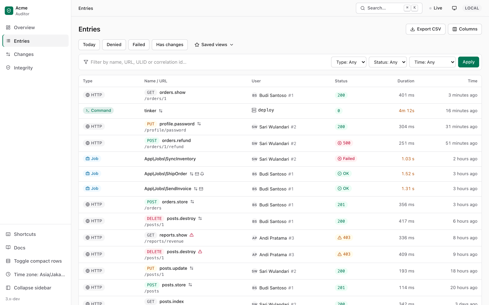
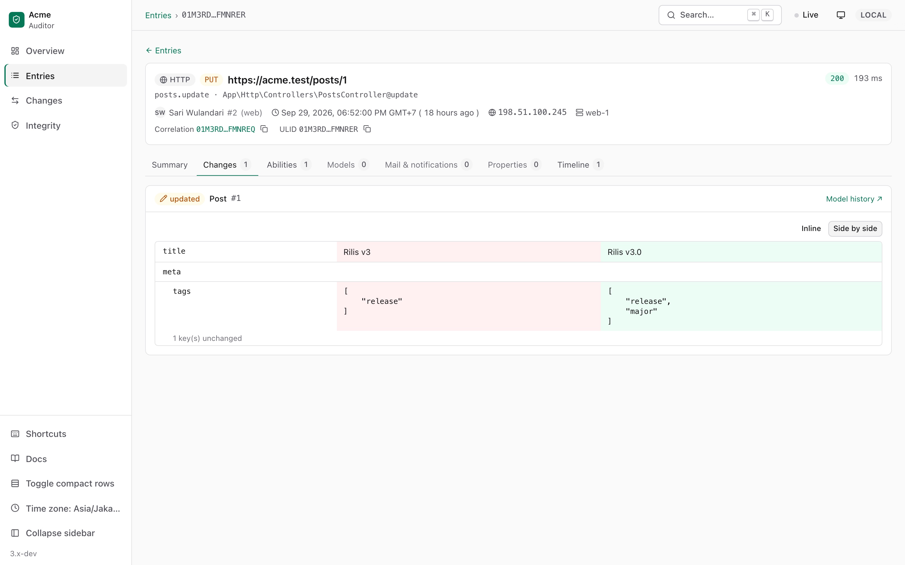
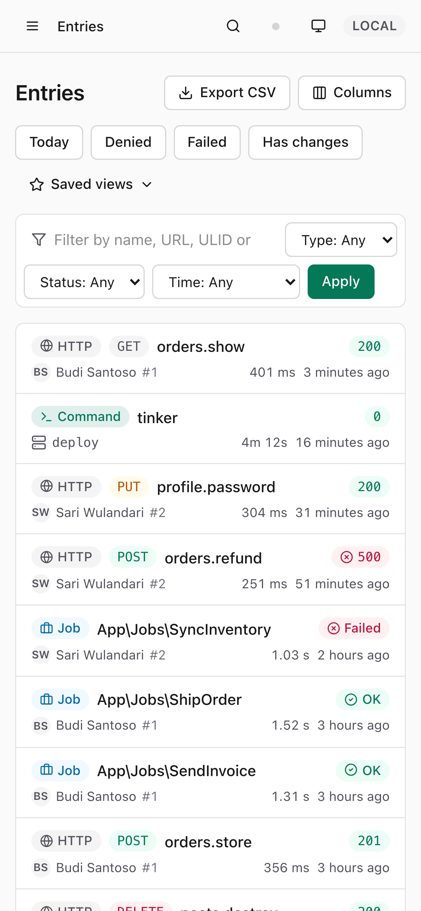

# Laravel Auditor

[](https://github.com/Rembonnn/laravel-auditor/actions/workflows/tests.yml)
[](https://codecov.io/gh/Rembonnn/laravel-auditor)
[](https://packagist.org/packages/rembon/laravel-auditor)
[](https://packagist.org/packages/rembon/laravel-auditor)


**Request-level audit trail for Laravel — who did what, what changed, and what they were allowed to do. Production-safe and compliance-ready.**

<picture>
  <source media="(prefers-color-scheme: dark)" srcset="docs/screenshots/dark.png">
  
</picture>

<details>
<summary>More screenshots</summary>

| Entries | Entry detail with diff | Mobile |
|---|---|---|
| <picture><source media="(prefers-color-scheme: dark)" srcset="docs/screenshots/entries-dark.png"></picture> | <picture><source media="(prefers-color-scheme: dark)" srcset="docs/screenshots/entry-dark.png"></picture> |  |

</details>

## Why Laravel Auditor?

Every HTTP request, queued job and artisan command becomes one **entry**: the user, the
route, the status, the abilities that were checked (granted or denied), the records that
were read, the mails and notifications that went out — and a diff of every model it changed.

| | Laravel Auditor v3 | spatie/laravel-activitylog | owen-it/laravel-auditing | Laravel Telescope |
|---|---|---|---|---|
| Unit of recording | **Request / job / command** | Manual event / model | Model event | Debug entry |
| Model change diff | ✅ | ✅ | ✅ | ⚠️ (debug) |
| Models read (read audit) | ✅ | ❌ | ⚠️ (retrieved) | ⚠️ |
| Abilities checked (granted/denied) | ✅ | ❌ | ❌ | ✅ (debug) |
| Mail & notifications sent | ✅ (no body) | ❌ | ❌ | ✅ (debug) |
| Correlation request → queued job | ✅ | ❌ | ❌ | ⚠️ (batch id) |
| Tamper-evident (hash chain) | ✅ | ❌ | ❌ | ❌ |
| Built for production | ✅ | ✅ | ✅ | ⚠️ (not recommended) |

## Installation

```bash
composer require rembon/laravel-auditor
php artisan auditor:install
```

`auditor:install` publishes the config and migrations, offers to migrate, and prints the
snippets below. Add `--integrity` to enable the hash chain.

## Quick start

Record the changes of a model:

```php
use Rembon\LaravelAuditor\Traits\Auditable;

class Post extends Model
{
    use Auditable;

    // Optional
    protected array $auditExclude = ['view_count'];
    protected array $auditEvents = ['updated', 'deleted'];
    protected bool $auditRetrieved = false;
}
```

Allow access to the dashboard outside `local` (it is **closed** by default):

```php
// AppServiceProvider::boot()
Gate::define('viewAuditor', fn (User $user) => $user->is_admin);
```

Schedule the maintenance commands:

```php
// routes/console.php
Schedule::command('auditor:prune')->daily();
Schedule::command('auditor:seal')->everyMinute()->withoutOverlapping(); // with integrity
Schedule::command('auditor:verify')->daily();                          // with integrity
```

Then open **`/auditor`**.

## Usage

```php
use Rembon\LaravelAuditor\Facades\Auditor;

// Enrich the current entry
Auditor::withProperty('order_id', $order->id);
Auditor::withProperties(['channel' => 'mobile']);
Auditor::tag('checkout', 'payment');

// Control recording
Auditor::ignore();                                 // drop this entry (model changes are kept)
Auditor::withoutAuditing(fn () => $post->save());  // nothing inside is recorded
Auditor::correlationId();                          // shared with the jobs it dispatches

// Customise (in a service provider)
Auditor::auth(fn (Request $request) => $request->user()?->isAdmin());
Auditor::resolveUserUsing(fn () => auth('admin')->user());
Auditor::filter(fn (EntryData $entry) => $entry->name !== 'health.check');
Auditor::redactUsing(fn (string $key, mixed $value) => $key === 'nik');
Auditor::extend('s3', fn (Application $app) => new S3Storage(/* ... */));
Auditor::displayUserUsing(fn ($user) => ['name' => $user->name, 'avatar' => $user->avatar_url]);
```

Query the trail:

```php
$post->audits;                                              // newest first
ModelChange::query()->causedBy($user)->since(now()->subWeek())->get();
Entry::query()->forCorrelation($id)->get();                 // request + its jobs
Entry::query()->withDeniedAbilities()->get();
```

### Testing your application

```php
Auditor::fake();

$this->actingAs($user)->put("/posts/{$post->id}", ['title' => 'New']);

Auditor::assertChangeRecorded(Post::class, $post->id, ChangeEvent::Updated,
    fn (ModelChangeData $change) => $change->newValues['title'] === 'New');
Auditor::assertEntryRecorded(fn (EntryData $e) => $e->userId === (string) $user->id);
Auditor::assertAbilityDenied('delete-post');
Auditor::assertNothingRecorded();
```

## Privacy & safety defaults

- Keys such as `password`, `*token*`, `*secret*`, `authorization`, card numbers, `$hidden`
  attributes and encrypted casts are replaced with `[REDACTED]` — in model diffs, input,
  properties and URL query strings.
- Mail bodies are never stored; recipients can be hashed (`mail.hash_recipients`).
- IPs can be anonymised (`http.capture.anonymize_ip`), request input is off by default.
- Recording never breaks your app: failures are reported, not thrown
  (`AUDITOR_THROW=true` in tests).
- Entries are written after the response is sent, or through the queue (`AUDITOR_QUEUE`).
- Integrity: rows are chained with HMAC-SHA256; `auditor:verify` detects modified and
  removed rows. It cannot protect against someone who holds both the key and the database.

## Limitations

Mass updates/deletes through the query builder, `insert()`, and pivot `attach()/detach()`
without a custom pivot model do not fire Eloquent events, so they are not recorded as
model changes.

## Ecosystem

- [**rembon/laravel-auditor-filament**](https://github.com/Rembonnn/laravel-auditor-filament): Filament 5 plugin with read-only
  Audit entries and Model changes resources, an `AuditsRelationManager` for any resource, and a stats widget.
- [**rembon/laravel-auditor-pulse**](https://github.com/Rembonnn/laravel-auditor-pulse): Laravel Pulse cards for denied
  abilities, top model changes and the most active users.

## Documentation

- **[Documentation site](https://rembonnn.github.io/laravel-auditor/)**
- [Upgrade from v2](UPGRADE.md)
- [Configuration reference](config/auditor.php)
- [Changelog](CHANGELOG.md)

## Development

```bash
composer test            # unit + feature
composer test:browser    # dashboard in a real browser (needs `npx playwright install chromium`)
composer analyse         # Larastan
composer serve           # workbench with demo data at http://localhost:8000/auditor
```

See [CONTRIBUTING.md](CONTRIBUTING.md). Report vulnerabilities privately — see [SECURITY.md](SECURITY.md).

## Credits

- [Rembon Karya Digital](https://github.com/rembonnn)
- [DayCod](https://github.com/dayCod)
- [Ade Yusuf](https://github.com/adeyusuf211)
- [All contributors](https://github.com/rembonnn/laravel-auditor/contributors)
- Icons: [Lucide](https://lucide.dev) (ISC)

## License

MIT. See [LICENSE](LICENSE).
